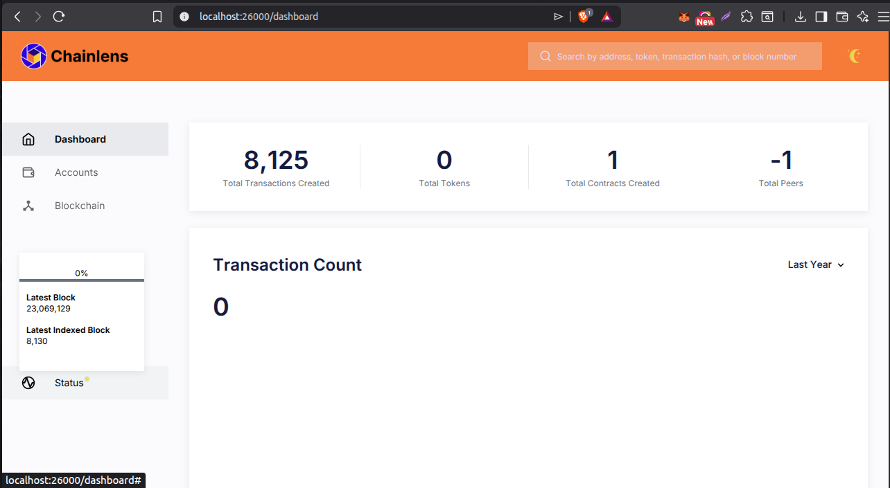

<!-- @format -->

# ChainLens-Free Project

This project is a **lightweight Ethereum blockchain explorer** that works with **Geth (Eth client)**, **MongoDB**, and **Redis**. It can be easily set up using Docker Compose.

---

## 🔹 Prerequisites

- Docker >= 20.x
- Docker Compose >= 2.x
- Git
- Internet connection (to pull Docker images)

---

## 🔹 Setup Instructions

### 1. Clone the Repository

```bash
git clone https://github.com/prashantyadav008/chainlens-free-setup.git
cd chainlens-free/docker-compose
```

### 2. Set Environment Variables (Temporary)

We need to set some environment variables for the current terminal session so that `docker-compose` can pick them up.

#### 2.1 Set NODE_ENDPOINT

```bash
export NODE_ENDPOINT=<rpc_url>
echo $NODE_ENDPOINT
```

#### 2.2 Set PORT

```bash
export PORT=26000
echo $PORT
```

### 3. Pull Docker Images

```bash
docker-compose pull
```

This command will pull the required images:

- Ethereum client (Geth)

- MongoDB

- Redis

- ChainLens app

### 4. Run Docker Containers

```bash
docker-compose up -d
docker ps -a
```

Expected containers:

- chainlens_eth

- chainlens_mongo

- chainlens_redis

- chainlens_app

### 5. Verify Ingestion Service (MOST IMPORTANT STEP)

ChainLens will only work correctly if the ingestion service is properly connecting to the blockchain node.

#### 5.1 Check Ingestion Logs

Run the following command:

```bash
docker-compose logs -f ingestion
```

#### 5.2 Expected Logs (Example)

You should see outputs like:

- Connecting to node
- Fetching block …
- Calculating metrics
- No continuous errors

#### 5.3 Common Errors

If you see errors such as:

- connection refused

- 429 rate limit

- invalid response

It indicates that the ingestion service is not able to connect to the blockchain node properly.

🔹 Tip: Make sure $NODE_ENDPOINT is set correctly and the node is accessible.

Check Logs:

```bash
docker-compose logs ingestion | grep error
```

#### 5.4 Check API Logs:

```bash
docker-compose logs -f api
```

Expected:

- Blocks syncing

- Transactions indexing

- Metrics calculation

### 6. Access API / Frontend

#### Health Check:

```bash
curl http://localhost:26000/api/actuator/health
```

#### Latest Blocks:

```bash
curl "http://localhost:26000/api/blocks?page=0&size=5"
```

#### Web UI:

Open browser → http://localhost:26000

### 7. Stop & Clean Containers

#### Stop all running containers:

```bash
docker-compose down
```

#### Remove containers, volumes & network (Clean Data):

```bash
docker-compose down -v
```

---


